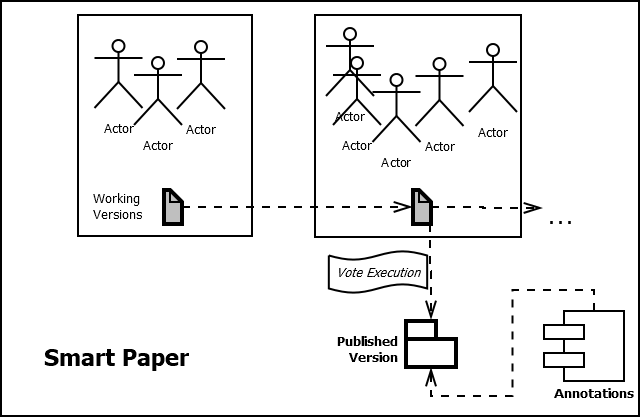

# Smart Papers App for Aragon (Ethereum)

This app allows you to connect to your Aragon DAO and create new Smart Papers.
 


## Usage

```sh
aragon init app.aragonpm.eth
```

## Running your app

### Using HTTP

Running your app using HTTP will allow for a faster development process of your app's front-end, as it can be hot-reloaded without the need to execute `aragon run` every time a change is made.

- First start your app's development server running `npm run start:app`, and keep that process running. By default it will rebuild the app and reload the server when changes to the source are made.

- After that, you can run `npm run start:aragon:http` which will compile your app's contracts, publish the app locally and create a DAO. You will need to stop it and run it again after making changes to your smart contracts.

Changes to the app's background script (`app/script.js`) cannot be hot-reloaded, after making changes to the script, you will need to either restart the development server (`npm run start:app`) or rebuild the script `npm run build:script`.

### Using IPFS

Running your app using IPFS will mimic the production environment that will be used for running your app. `npm run start:aragon:ipfs` will run your app using IPFS. Whenever a change is made to any file in your front-end, a new version of the app needs to be published, so the command needs to be restarted.

This app has 3 environments defined in `arapp.json`:

| Environment   | Network   |
|---            |---        |
| default       | localhost |
| staging       | rinkeby   |
| production    | mainnet   |

Prerequisites:
- ENS Registry address


The `rinkeby` network is further defined in `truffle.js`, and has:
- an Ethereum provider (to **write** to the blockchain):
    - an address (`https://rinkeby.infura.io`)
    - an Ethereum Account (`0xb4124cEB3451635DAcedd11767f004d8a28c6eE7`)
    (which is the first account generated from the `DEFAULT_MNEMONIC` variable, to use a different account see [here](#Using-a-different-Ethereum-account))

### Check published versions

Command:
```
npm run versions -- --environment staging
```
